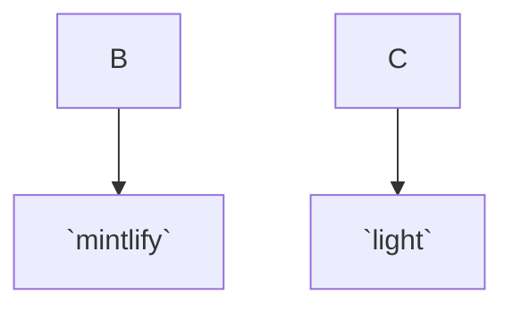

# Mintlify Starter Kit

Click on `Use this template` to copy the Mintlify starter kit. The starter kit contains examples including

*   Guide pages

*   Navigation

*   Customizations

*   API Reference pages

*   Use of popular components
<br/>

### 👩‍💻 Development

Install the [Mintlify CLI](https://www.npmjs.com/package/mintlify) to preview the documentation changes locally. To install, use the following command

```
npm i -g mintlify
```

<br/>

<!--MERMAID {width:100}-->

<!--MCONTENT {content: "graph TD;\n\nB \\-\\-\\> `mintlify`<swm-token data-swm-token=\":mint.json:33:9:9:`      &quot;url&quot;: &quot;https://mintlify.com&quot;`\"/>;\n\nC \\-\\-\\> `light`<swm-token data-swm-token=\":mint.json:6:2:2:`    &quot;light&quot;: &quot;/logo/light.png&quot;`\"/>;\n\n<br/>"} --->

<br/>

Run the following command at the root of your documentation (where mint.json is)

```
mintlify dev
```

### 😎 Publishing Changes

graph TD;

A-->B;

A-->C;

B-->D;

C-->D;Changes will be deployed to production automatically after pushing to the default branch.

You can also preview changes using PRs, which generates a preview link of the docs.

#### Troubleshooting

*   Mintlify dev isn't running - Run `mintlify install` it'll re-install dependencies.

*   Page loads as a 404 - Make sure you are running in a folder with `📄 mint.json`

`authentication`<swm-token data-swm-token=":mint.json:48:12:12:`      &quot;pages&quot;: [&quot;api-reference/authentication&quot;]`"/> file

<br/>

<br/>

This file was generated by Swimm. [Click here to view it in the app](https://app.swimm.io/repos/Z2l0aHViJTNBJTNBZG9jcyUzQSUzQXN0ZWRkYQ==/docs/chj6gw9v).
